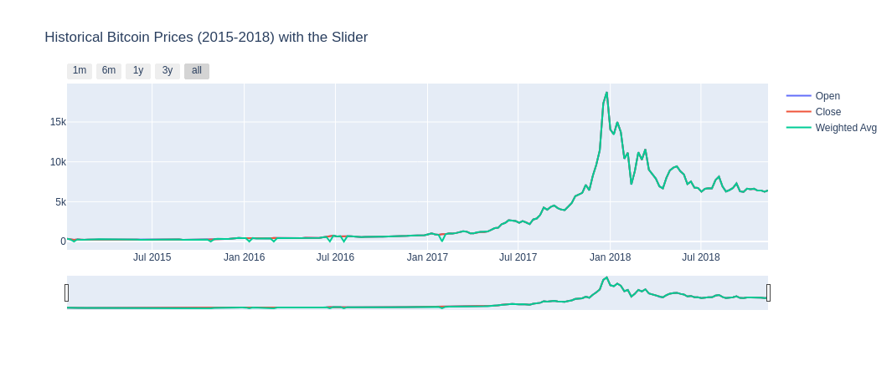
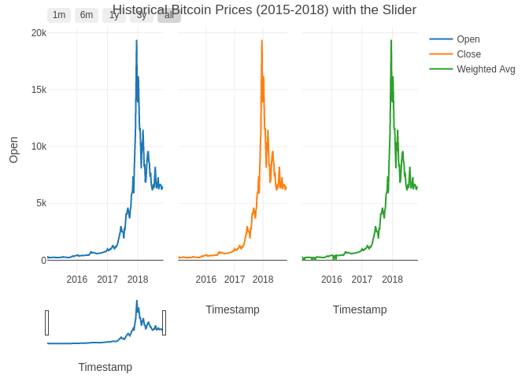

# BITCOIN

------------------------------------------------------------------------


Bitcoin, introduced in 2009 by the mysterious Satoshi Nakamoto, stands as the pioneering cryptocurrency.
It operates on a decentralized peer-to-peer network, allowing secure and transparent transactions without the need for a central authority.
Bitcoin's blockchain technology records every transaction in a public ledger, ensuring immutability and trustworthiness through cryptographic hashing.

Our project is structured into two key sections:

**1. Data Exploration** - Analyzing and visualizing Bitcoin price data.
- Identifying trends and patterns in historical price movements.

**2. Time Series Analysis and Forecasting** - **Forecasting Methods:** - **LSTM (Long Short-Term Memory):** Leveraging deep learning to capture complex temporal dependencies.
- **XGBoost:** Harnessing gradient boosting to predict Bitcoin price fluctuations.
- **Facebook Prophet:** Using a versatile tool for forecasting seasonality and holidays.
- **ARIMA (AutoRegressive Integrated Moving Average):** Employing a traditional statistical approach for time series forecasting.

This project draws inspiration from notable kernels and tutorials, including those focused on Prophet, XGBoost, and ARIMA models, tailored specifically for Bitcoin price prediction.

For those new to Bitcoin, you can learn more about its fundamentals [here](https://www.coindesk.com/information/what-is-bitcoin).


------------------------------------------------------------------------


# Checking out the dataset in my data folder

From the code below  we set a default data folder we run the code and list the data files in the folder. For our case, it's

-   "bitstampUSD_1-min_data_2012-01-01_to_2018-11-11.csv"

This file has the daily data from 2012 first of January to 2018 eleventh of November hourly market prices for BTC

-   "coinbaseUSD_1-min_data_2014-12-01_to_2018-11-11.csv"

This file has the daily data from 2014 first of January to 2018 eleventh of November hourly market prices for BTC

```{r, message=FALSE}
# Set the directory path where the data is located
data_dir <- "~/Git/Data"

# List files in the directory specified by data_dir
dir_contents <- list.files(data_dir)

# Print the contents of the directory to the console
print(dir_contents)

```

# Environment preparation

## Getting packages

```{r, message=FALSE}
# Define the list of package names
packages <- c("tidyverse", "plotly", "lubridate", "readr", "dplyr", "zoo", "ggplot2", "forecast", "stats", "tseries")
# Use lapply to load each package
lapply(packages, require, character.only = TRUE)
```


## Data importation

-   **The data importation utilizes the read_csv function from the readr library. our Data has a Timestamp which will be converted to readable form with the code line `mutate(Timestamp = as.POSIXct(Timestamp, origin = "1970-01-01", tz = "UTC"))`**

-   The line interprets the Timestamp in a human-readable form.
    We set the format to UTC and then give it a sample date to use like in our case 1970-01-01.
    and set the path to our file.

-   Here we end the code by displaying the first 6 rows of data.

```{r, message=FALSE}
# Define a function to parse timestamps from seconds since the Unix epoch
dateparse <- function(time_in_secs) {
  as_datetime(as.numeric(time_in_secs), origin = "1970-01-01", tz = "UTC")
}

# Expand the tilde to the home directory and specify the file path
file_path <- "~/Git/Data/coinbaseUSD_1-min_data_2014-12-01_to_2018-11-11.csv"

# Read the CSV file into a data frame named 'data'
data <- read_csv("~/Git/Data/coinbaseUSD_1-min_data_2014-12-01_to_2018-11-11.csv")

# Convert the 'Timestamp' column from numeric Unix timestamps to POSIXct date-time objects
data <- data %>%
  mutate(Timestamp = as.POSIXct(Timestamp, origin = "1970-01-01", tz = "UTC"))

# Display the first few rows of the 'data' data frame
#head(data)

```


### Summary Statistics

Summary statistics display the minimum and maximum values, explaining the range.
They also include the 1st quantile (Q1), median (Q2), and third quantile (Q3), which elaborate on the interquartile range.
The summary also highlights the total number of missing variables in each column.

```{r}
summary(data)
```


## Data Cleaning

### Data handling Comparison with python


| **`R Code`**                                                                      | **`Python Code`**                                                                      |
|-------------------------------------|-----------------------------------|
| `r`                                                                               | `python`                                                                               |
| \# Load required libraries                                                        | \# Import necessary libraries                                                          |
| library(dplyr)                                                                    | import pandas as pd                                                                    |
| library(zoo)                                                                      | import numpy as np                                                                     |
|                                                                                   |                                                                                        |
| \# Sample data                                                                    | \# Sample data                                                                         |
| data \<- data.frame(                                                              | data = pd.DataFrame({                                                                  |
| Timestamp = seq.POSIXt(from = as.POSIXct("2022-01-01 00:00"),                     | 'Timestamp': pd.date_range(start='2022-01-01', periods=10, freq='H'),                  |
| by = "hour", length.out = 10),                                                    | 'Volume\_(BTC)': [0.5, np.nan, 0.6, np.nan, np.nan, 0.7, 0.8, np.nan, 0.9, 1.0],       |
| `Volume_(BTC)` = c(0.5, NA, 0.6, NA, NA, 0.7, 0.8, NA, 0.9, 1.0),                 | 'Volume\_(Currency)': [500, np.nan, 600, np.nan, np.nan, 700, 800, np.nan, 900, 1000], |
| `Volume_(Currency)` = c(500, NA, 600, NA, NA, 700, 800, NA, 900, 1000),           | 'Weighted_Price': [100, np.nan, 102, np.nan, np.nan, 105, 106, np.nan, 108, 109],      |
| Weighted_Price = c(100, NA, 102, NA, NA, 105, 106, NA, 108, 109),                 | 'Open': [100, 101, np.nan, 103, np.nan, 105, 106, np.nan, 108, 109],                   |
| Open = c(100, 101, NA, 103, NA, 105, 106, NA, 108, 109),                          | 'High': [101, 102, np.nan, 104, np.nan, 106, 107, np.nan, 109, 110],                   |
| High = c(101, 102, NA, 104, NA, 106, 107, NA, 109, 110),                          | 'Low': [99, 100, np.nan, 102, np.nan, 104, 105, np.nan, 107, 108],                     |
| Low = c(99, 100, NA, 102, NA, 104, 105, NA, 107, 108),                            | 'Close': [100, 101, np.nan, 103, np.nan, 105, 106, np.nan, 108, 109]                   |
| Close = c(100, 101, NA, 103, NA, 105, 106, NA, 108, 109)                          | })                                                                                     |
| )                                                                                 |                                                                                        |
|                                                                                   |                                                                                        |
| \# Replace NA with 0 for volume/trade-related fields                              | \# Replace NA with 0 for volume/trade-related fields                                   |
| data \<- data %\>%                                                                | data['Volume\_(BTC)'].fillna(value=0, inplace=True)                                    |
| mutate(`Volume_(BTC)` = ifelse(is.na(`Volume_(BTC)`), 0, `Volume_(BTC)`),         | data['Volume\_(Currency)'].fillna(value=0, inplace=True)                               |
| `Volume_(Currency)` = ifelse(is.na(`Volume_(Currency)`), 0, `Volume_(Currency)`), | data['Weighted_Price'].fillna(value=0, inplace=True)                                   |
| Weighted_Price = ifelse(is.na(Weighted_Price), 0, Weighted_Price))                |                                                                                        |
|                                                                                   |                                                                                        |
| \# Fill forward NA values for OHLC data                                           | \# Fill forward NA values for OHLC data                                                |
| data$Open <- zoo::na.locf(data$Open)                                              | data['Open'].fillna(method='ffill', inplace=True)                                      |
| data$High <- zoo::na.locf(data$High)                                              | data['High'].fillna(method='ffill', inplace=True)                                      |
| data$Low <- zoo::na.locf(data$Low)                                                | data['Low'].fillna(method='ffill', inplace=True)                                       |
| data$Close <- zoo::na.locf(data$Close)                                            | data['Close'].fillna(method='ffill', inplace=True)                                     |
|                                                                                   |                                                                                        |
| \# Convert 'Timestamp' column to POSIXct                                          | \# Convert 'Timestamp' column to datetime                                              |
| data \<- data %\>%                                                                | data['Timestamp'] = pd.to_datetime(data['Timestamp'], unit='s', utc=True)              |
| mutate(Timestamp = as.POSIXct(Timestamp, origin = "1970-01-01", tz = "UTC"))      |                                                                                        |
|                                                                                   |                                                                                        |
| \# Display the first few rows of the updated dataframe                            | \# Display the first few rows of the updated dataframe                                 |
| head(data)                                                                        | print(data.head())                                                                     |
| `|`                                                                               |                                                                                        |

### Comments on Differences:

1.  **Library Usage**:
    -   R uses `dplyr` for data manipulation and `zoo` for forward filling.
    -   Python uses `pandas` for both data manipulation and forward filling.
2.  **NA Replacement**:
    -   In R, `ifelse` within `mutate` is used to replace NA values.
    -   In Python, `fillna` is used directly on the DataFrame columns.
3.  **Forward Filling**:
    -   R uses `zoo::na.locf` to forward fill values.
    -   Python uses `fillna(method='ffill')` for forward filling.
4.  **Timestamp Conversion**:
    -   R uses `as.POSIXct` to convert numeric Unix timestamps.
    -   Python uses `pd.to_datetime` with `unit='s'` and `utc=True` to achieve the same.

### Handling missing values

-   From the code below we fill in missing values in the Open High Low and Close columns and replace NAs with the previous value from the one above it.

-   This approach, in the beginning, helps to maintain the continuity of data without losing important rows of the data in other columns.

```{r}
# Fill NA values with zeroes for volume/trade-related fields using dplyr's mutate function
data <- data %>%
  mutate(`Volume_(BTC)` = ifelse(is.na(`Volume_(BTC)`), 0, `Volume_(BTC)`),  # Replace NA with 0 in 'Volume_(BTC)'
         `Volume_(Currency)` = ifelse(is.na(`Volume_(Currency)`), 0, `Volume_(Currency)`),  # Replace NA with 0 in 'Volume_(Currency)'
         Weighted_Price = ifelse(is.na(Weighted_Price), 0, Weighted_Price))  # Replace NA with 0 in 'Weighted_Price'

# Fill forward NA values (last observation carried forward) for OHLC data using zoo's na.locf function
data$Open <- zoo::na.locf(data$Open)    # Fill NA values in 'Open' column
data$High <- zoo::na.locf(data$High)    # Fill NA values in 'High' column
data$Low <- zoo::na.locf(data$Low)      # Fill NA values in 'Low' column
data$Close <- zoo::na.locf(data$Close)  # Fill NA values in 'Close' column

# Convert 'Timestamp' column from numeric Unix timestamps to POSIXct date-time objects in UTC timezone
data <- data %>%
  mutate(Timestamp = as.POSIXct(Timestamp, origin = "1970-01-01", tz = "UTC"))

# Display the first few rows of the updated dataframe 'data'
#head(data)
```


### Getting weekly data

-   The code below groups the data by weeks where we create weekly groupings every 7 days from the date `2015-01-01 00:00:00` to `2018-11-11 00:00:00`. after this, we display the weekly data created and stored as weekly_rows

```{r}
# Create valid date range
start <- ymd_hms("2015-01-01 00:00:00", tz = "UTC")  # Define start date-time in UTC timezone
end <- ymd_hms("2018-11-11 00:00:00", tz = "UTC")    # Define end date-time in UTC timezone

# Find rows between start and end time in 'data' dataframe
filtered_data <- data %>%
  filter(Timestamp >= start & Timestamp <= end)  # Filter data for rows with Timestamp between 'start' and 'end'

# Find the first row of each week (starting on Monday) in filtered_data
weekly_rows <- filtered_data %>%
  mutate(Week = floor_date(Timestamp, unit = "week", week_start = 1)) %>% # Create 'Week' column by flooring Timestamp to the nearest week starting on Monday
  group_by(Week) %>%        # Group rows by 'Week' column
  slice(1) %>%               # Select the first row from each group (week)
  ungroup()                  # Remove grouping for further operations

# Display the first few rows of weekly_rows dataframe
#head(weekly_rows)

```


## Vizualizations

### Let's visualize Historical Bitcoin Market Volume (2015-2018)-Yearly

In the code below we utilize the plotly function from the plotly package to create an interactive plot.
The interactive plot takes in arguments of labels for 1 month 6month and 12 months to make the widgets more interactive.

#### Comparison of the python plot and R plot

 

The Python output doesn't distinguish the open-closed and weighted_price clearly in the plot.
Although the plots interactively match that of R programming, we see a superiority of the R language in handling the visualizations in a more versatile manner by creating multiple facets for each column while still maintaining the same x and y axis. The plots on the other hand show a rising trend in Bitcoin and a drop in 2018 onwards.

```{r}
# Create the traces for each line plot
trace1 <- plot_ly(data = weekly_rows, x = ~Timestamp, y = ~Open, type = 'scatter', mode = 'lines', name = 'Open')
trace2 <- plot_ly(data = weekly_rows, x = ~Timestamp, y = ~Close, type = 'scatter', mode = 'lines', name = 'Close')
trace3 <- plot_ly(data = weekly_rows, x = ~Timestamp, y = ~Weighted_Price, type = 'scatter', mode = 'lines', name = 'Weighted Avg')

# Combine the traces into a subplot with shared axes
fig <- subplot(trace1, trace2, trace3, nrows = 1, shareX = TRUE, shareY = TRUE)

# Update the layout of the plot with title, x-axis options, and range slider
fig1 <- fig %>% layout(
  title = 'Historical Bitcoin Prices (2015-2018) with the Slider',  # Set the title of the plot
  xaxis = list(
    rangeselector = list(
      buttons = list(
        list(count = 1, label = '1m', step = 'month', stepmode = 'backward'),  # Button for 1 month range
        list(count = 6, label = '6m', step = 'month', stepmode = 'backward'),  # Button for 6 months range
        list(count = 12, label = '1y', step = 'month', stepmode = 'backward'),  # Button for 1 year range
        list(count = 36, label = '3y', step = 'month', stepmode = 'backward'),  # Button for 3 years range
        list(step = 'all')  # Button for showing all data
      )
    ),
    rangeslider = list(visible = TRUE),  # Enable the range slider for zooming
    type = 'date'  # Set the type of x-axis to date
  )
)

# Plot the figure
fig1
```


### Let's visualize Historical Bitcoin Prices (2015-2018) - Monthly

This code functions exactly as the previous one. The plot shows a spike in prices every October - December for each year.
This can only be noticed when hovering over the plots and the interactivity becomes active.

#### Comparison with python plot

 .png)

These two plots are similar, hence both languages would suit the job for this code.

```{r}
# Create the trace for Volume (Currency)
trace1 <- plot_ly(data = weekly_rows, x = ~Timestamp, y = ~`Volume_(Currency)`, type = 'scatter', mode = 'lines', name = 'Bitcoin Volume (USD)')

# Update layout with title, x-axis options, and range slider
fig2 <- trace1 %>% layout(
  title = 'Historical Bitcoin Volume (USD) (2015-2018) with the slider',  # Set the title of the plot
  xaxis = list(
    rangeselector = list(
      buttons = list(
        list(count = 1, label = '1m', step = 'month', stepmode = 'backward'),  # Button for 1 month range
        list(count = 6, label = '6m', step = 'month', stepmode = 'backward'),  # Button for 6 months range
        list(count = 12, label = '1y', step = 'month', stepmode = 'backward'),  # Button for 1 year range
        list(count = 36, label = '3y', step = 'month', stepmode = 'backward'),  # Button for 3 years range
        list(step = 'all')  # Button for showing all data
      )
    ),
    rangeslider = list(visible = TRUE),  # Enable the range slider for zooming
    type = 'date'  # Set the type of x-axis to date
  )
)

# Plot the figure
fig2
```

### BTC Volume

This is a BTC Volume plot where we see the relationship between the BTC volume and weighted price.
There is a cluster of Volumes at specific prices.

**History of Bitcoin Prices**

-   18 August 2008, the domain name bitcoin.org was registered.
-   November 6th 2010, Bitcoin share capital reaches 1 million USD. Its exchange rate on MtGox reaches USD 0.50 per BTC.
-   June 2nd 2011, USD to BTC rate is 10 USD to the coin. For 6 days, the Bitcoin value is fixed at 31.91 USD on MtGox.
-   February 28th 2013, Bitcoin exchange rate surpasses 31.91 USD for the first time for the last 601 days.
-   April 1st,2013 Exchange rate of Bitcoin reaches 100 USD to 1 BTC.
-   January,2015 Coinbase raised 75 million USD as part of a Series C funding round, smashing the previous record for a bitcoin company.
-   February ,2015 Bitcoin price reached USD 262.
-   January 2017,After the rally for most of the second half of 2016, bitcoin broke the USD 1,000 mark for the first time in 3 years.
-   June 12th 2017, Bitcoin exchange rate exceeds USD 3000 to the BTC.
-   November 29th 2017, Bitcoin price exceeds USD 10,000.
-   December 18th 2017, Bitcoin reaches a record high, but does not reach USD 20,000.
-   December 28th 2017, The price of bitcoins fell after South Korea announced additional measures to regulate bitcoin trading, including the potential closure of exchanges, among the volatile movements in the world's third largest cryptocurrency market.
-   October 31st 2018, USD 6,300, on the 10 year anniversary of Bitcoin, price holds steady above USD 6,000 during a period of historically low volatility.
